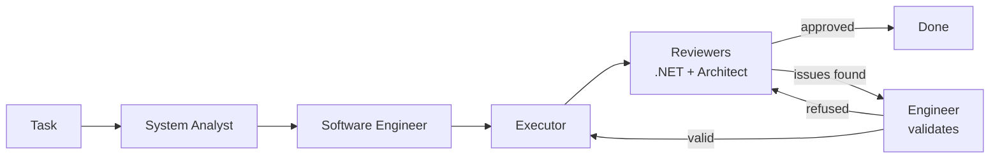
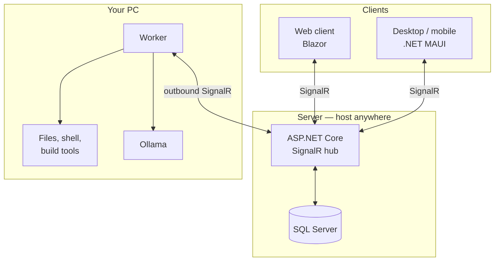

# CodingAgents

A self-hosted, multi-agent coding assistant. You chat from a browser or desktop app, and AI
agents do the work **on your own machine** — reading your files, editing code, running builds
and tests, and reporting back.

The key idea is the split between a **server** you can host anywhere and a **worker** that runs
on the computer where your code lives. The worker makes an outbound connection to the server, so
your development machine never needs an open inbound port.

---

## Table of contents

- [What it does](#what-it-does)
- [Architecture](#architecture)
- [Features](#features)
- [Prerequisites](#prerequisites)
- [Getting started](#getting-started)
- [Configuration](#configuration)
- [Using the app](#using-the-app)
- [Security](#security)
- [Project structure](#project-structure)
- [Troubleshooting](#troubleshooting)
- [License](#license)

---

## What it does

CodingAgents gives you two ways to put AI agents to work on a real codebase:

**1. Direct chat** — a single agent with full access to a working folder. Ask it to inspect a
project, make an edit, run `dotnet build`, take a screenshot, or summarise a file you attach.
It uses tools to actually do these things rather than just describing them.

**2. Team workflows** — a pipeline of specialised agents that review each other's work:



The analyst inspects the real codebase and writes an implementation plan. The engineer refines it.
The executor applies the changes. Two reviewers — a .NET/SQL specialist and a solution architect —
independently inspect the actual result and submit a verdict. If they find problems, the engineer
either accepts them and produces fix instructions, or *refuses* with a justification that the
reviewers then accept or reject. The loop repeats until both reviewers approve or the iteration
limit is reached.

Every agent role can run on a different model, so you can put a cheap local model on execution
and a stronger one on review.

---

## Architecture



| Project | What it is |
|---|---|
| `CodingAgents.Server` | ASP.NET Core app hosting the SignalR hub (`/chathub`), the database, authentication and stored artifacts. |
| `CodingAgents.Worker` | Runs on your PC. Connects out to the server, runs the agents, and is the only component that touches your files. |
| `CodingAgents.Client` | Razor class library containing the shared chat UI used by both front-ends. |
| `CodingAgents.WebClient` | Blazor web front-end. |
| `CodingAgents.MauiClient` | .NET MAUI app (Windows, Android, iOS, macOS). |
| `CodingAgents.Shared` | Entities and DTOs shared by server, worker and clients. |

Because the worker dials out, the server can sit on cheap shared hosting while the worker runs
behind your home or office NAT with no port forwarding.

---

## Features

### Agent tools

The worker exposes these to the models as callable tools:

| Tool | Purpose |
|---|---|
| `ListFiles` | List files in the working folder (skips `bin`, `obj`, `.git`, `node_modules`). |
| `SearchInFiles` | Regex search across file contents. Pure .NET — no external `grep` needed. |
| `ReadFile` | Read a file. |
| `WriteFile` | Create or overwrite a file. |
| `EditFile` | Replace an exact block of text, with occurrence-count safety checks. |
| `ExecuteCommand` | Run a shell command (e.g. `dotnet build`), with a timeout and truncated output. |
| `TakeScreenshot` | Capture the screen and post it into the chat. |
| `AttachImage` | Show an existing image file in the chat. |

Relative paths resolve inside the task's working folder; absolute paths may reach anywhere the
worker's user account can (see [Security](#security)).

### Model providers

Configure any number of endpoints under **Settings → Model Configurations**:

- **Ollama** — local models
- **OpenAI** — or any OpenAI-compatible endpoint via a custom base URL
- **Anthropic** — Claude models

Then assign a configuration to each role: chat, analyst, engineer, executor, .NET reviewer,
architect reviewer.

> Tool calling only works well with models that support it. Very small local models often fail to
> emit tool calls and will appear to "ignore" instructions.

### Execution back-ends

- **Local agent** (default) — runs the plan through the worker's own tool-using agent.
- **Claude Code CLI** — hands the plan to the Claude CLI. The worker watches Claude's rate-limit
  state and automatically queues tasks while limits are active, resuming when they reset.

### Working folders

Each chat session and each workflow gets its **own isolated folder**, so tasks don't collide.
For workflows you can also specify an exact folder to work in, and the team reports back the
resolved path.

### Other

- Live pipeline graph showing which agent is active
- Stop button and follow-up messages on running workflows
- File uploads into the conversation (relayed into the agent's working folder)
- Inline screenshots and images
- Conversation memory across turns
- Optional WhatsApp / email alerts for Claude rate-limit changes

---

## Prerequisites

| Requirement | Notes |
|---|---|
| [.NET 10 SDK](https://dotnet.microsoft.com/download) | All projects target `net10.0`. |
| SQL Server | LocalDB, Express, or a hosted instance. The schema is created automatically. |
| [Ollama](https://ollama.com/) | Optional — only if you want to run local models. |
| .NET MAUI workloads | Optional — only to build the desktop/mobile client: `dotnet workload install maui`. |
| Claude Code CLI | Optional — only if you select it as the executor. |

The worker is **Windows-specific** in places (it uses PowerShell for shell commands and screen
capture). The server and web client are cross-platform.

---

## Getting started

### 1. Clone and restore

```bash
git clone <your-repo-url>
cd CodingAgents
dotnet restore CodingAgents.slnx
```

### 2. Configure

Fill in the placeholders marked `REPLACE WITH:` in the config files. The minimum to get running:

**`src/CodingAgents.Server/appsettings.json`**

```jsonc
{
  "ConnectionStrings": {
    "DefaultConnection": "Server=(localdb)\\MSSQLLocalDB;Database=CodingAgentsDb;Trusted_Connection=True;MultipleActiveResultSets=true;TrustServerCertificate=True"
  },
  "WorkerKey": "<a long random string>",
  "AllowedOrigins": ""
}
```

**`src/CodingAgents.Worker/appsettings.json`**

```jsonc
{
  "ServerUrl": "https://localhost:7150/",
  "WorkerKey": "<the same random string>"
}
```

**`src/CodingAgents.WebClient/appsettings.json`**

```jsonc
{
  "ServerUrl": "https://localhost:7150"
}
```

See [SETUP.md](SETUP.md) for the complete list of settings, including the optional
notification channels.

### 3. Run

Start the server:

```bash
dotnet run --project src/CodingAgents.Server
```

Start the worker — **as a normal app in your logged-in desktop session**, not as a Windows
service (see [Troubleshooting](#troubleshooting)):

```bash
dotnet run --project src/CodingAgents.Worker
```

Start the web client:

```bash
dotnet run --project src/CodingAgents.WebClient
```

Then open the web client (default `https://localhost:7002`).

### 4. Sign in

The app creates a single access password on first run:

```
admin
```

**Change it immediately** under **Settings → App Password**. A warning banner appears while the
default is still in use.

### 5. Verify

In the sidebar you should see two green indicators:

- **Server connected** — the client reached the server
- **Local agent online** — a worker is registered

If the agent shows offline, the worker isn't connected; check its console output.

---

## Configuration

| Setting | Where | Purpose |
|---|---|---|
| `ConnectionStrings:DefaultConnection` | Server | Database connection. |
| `WorkerKey` | Server **and** Worker | Shared secret. Must match, or the server rejects the worker. |
| `AllowedOrigins` | Server | Comma-separated client origins allowed by CORS. Empty = localhost only. |
| `ServerUrl` | Worker, WebClient, MauiClient | Base URL of the server. |
| `OllamaUrl` | Worker | Local Ollama endpoint. Defaults to `http://localhost:11434/`. |
| `WorkspaceRoot` | Worker | Root for per-task folders. Defaults to `%LocalAppData%\CodingAgents\Workspaces`. |
| `WhatsApp`, `Email` | Server | Optional rate-limit notifications. Disabled unless configured. |

Model endpoints and per-agent model assignments are configured **in the app UI**, not in these
files — they're stored in the database.

For production, prefer environment variables over config files for secrets:

```bash
ConnectionStrings__DefaultConnection="..."
Email__Password="..."
```

---

## Using the app

### Direct chat

1. Click **New Chat**.
2. Ask for what you want — for example *"list the files in the workspace and summarise the
   project structure"*, or *"add a null check to Foo.cs and run dotnet build"*.
3. Watch the **Diagnostics** panel to see each tool call and its output as the agent works.

Quick-command buttons below the input send common requests in one click: Screenshot, Build,
Test, List Files, Git Status. The 📎 button attaches a file to the conversation and drops it
into the agent's working folder.

### Team workflows

1. Open the **Team** tab.
2. Describe the development task.
3. Optionally set a **working folder** — leave blank for an isolated per-task folder.
4. Submit, then watch the pipeline graph and the execution log.

While a workflow runs you can **Stop** it, or send a **follow-up** instruction that re-engages
the team in the same folder.

### Settings

- **Default executor** — local agent or Claude Code CLI
- **Model configurations** — add Ollama / OpenAI / Anthropic endpoints
- **Per-role models** — chat, analyst, engineer, executor, both reviewers
- **Max review iterations** — how many fix-and-review rounds before declaring a stalemate
- **App password** — change it here

---

## Security

This project is designed for **personal, trusted use**. Understand these points before exposing
it beyond your own machine.

**What's protected**

- A single app password, stored as a PBKDF2-SHA256 hash with a per-credential salt.
- **Every** hub method requires authentication, enforced server-side by a hub filter — not just
  by the login screen.
- Session tokens allow re-authentication after a reconnect and are revoked when the password
  changes.
- The worker must present a matching `WorkerKey` to register, so a rogue client can't impersonate
  it and receive your tasks.
- CORS is restricted to configured origins (localhost only by default).
- Generated artifacts (screenshots, uploads) require a short-lived capability token to download.

**What to be aware of**

- **The agent can run arbitrary commands and modify files on the worker's machine.** That is the
  entire point of the product, but it means anyone who can sign in effectively has code execution
  on that machine. Use a strong password and don't expose the server publicly without TLS.
- Absolute paths let the agent read and write **anywhere the worker's user account can reach**,
  not just its task folder. Run the worker under a restricted account if that matters to you.
- There is one shared password and no per-user separation. Any signed-in user sees all sessions,
  workflows and artifacts.
- API keys for model providers are stored in the database and are readable by signed-in clients.

**Before you publish this repo**

- Never commit real values for `WorkerKey`, connection strings, the `Email` section, or publish
  profiles. The included `.gitignore` covers the usual suspects.
- Rotate any credential that was ever committed.

---

## Project structure

```
CodingAgents.slnx
├── src/
│   ├── CodingAgents.Server/      ASP.NET Core + SignalR hub + EF Core
│   │   ├── Hubs/                 ChatHub, AuthHubFilter
│   │   ├── Services/             Password, tokens, worker registry, workflow manager
│   │   ├── Data/                 EF Core DbContext
│   │   └── Migrations/
│   ├── CodingAgents.Worker/      Local agent host
│   │   └── Tools/                WorkspaceTools — the agent's capabilities
│   ├── CodingAgents.Client/      Shared Blazor chat UI
│   ├── CodingAgents.WebClient/   Blazor web front-end
│   ├── CodingAgents.MauiClient/  MAUI desktop/mobile front-end
│   └── CodingAgents.Shared/      Entities and DTOs
├── README.md
└── SETUP.md
```

Build everything:

```bash
dotnet build CodingAgents.slnx
```

If you don't have the MAUI workloads installed, build the individual projects you need instead:

```bash
dotnet build src/CodingAgents.Server
dotnet build src/CodingAgents.Worker
dotnet build src/CodingAgents.WebClient
```

---

## Troubleshooting

**"Local agent offline" in the sidebar**
The worker isn't connected. Check its console: a `WorkerKey` mismatch is logged explicitly.
Confirm `ServerUrl` points at the running server.

**Screenshots come out blank or fail**
The worker needs a real, visible desktop. It cannot capture the screen when running as a
**Windows service** (session 0), over a **disconnected RDP** session, or on a **locked** screen.
Run the worker as a normal app in your logged-in, unlocked session. The error message reports
which case it detected.

**The agent replies with prose instead of using its tools**
The selected model is too weak at tool calling. Switch that role to a stronger, tool-capable
model. Configuration cannot force a model to call a tool — it can only make them available.

**"Configured Ollama model … is not installed"**
Deliberate: the app fails loudly rather than silently substituting a different model. Run
`ollama pull <model>` or pick an installed one.

**Database errors on startup**
Check `ConnectionStrings:DefaultConnection`. The schema is created automatically on first run,
so the account needs permission to create tables.

**Browser can't reach the server / CORS errors**
Add the client's origin to `AllowedOrigins` on the server.

---

## License

No license has been chosen yet. Without one, default copyright applies and others may not legally
reuse the code. If you want this to be open source, add a `LICENSE` file — see
[choosealicense.com](https://choosealicense.com/) for help picking one.
